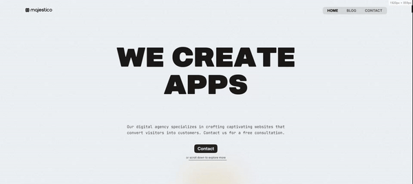

# [Mintaka](https://mintaka.majestico.co)

> [!IMPORTANT]
> Currently this theme only works with the premium version of GSAP, the steps to use the standard version will be available in the future.

Mintaka is a template made with [Astro](https://astro.build), [Tailwind](https://tailwindcss.com/) and [Gsap](https://gsap.com/)

### [🧪 Site preview →](https://mintaka.majestico.co)

### [🧑‍🚀 Astro website →](https://astro.build/)

### [🕮 Astro docs →](https://docs.astro.build/en/getting-started/)

---

## Preview

## 🧪 Test

On the folder run

1. `bun install`  <small>(or `yarn` or `pnpm i`)</small>
2. `bun run dev`  <small>(or `yarn dev` or `pnpm dev`)</small>

## ✅ Features

- [x] Localization
- [x] Blog

---

<a href="https://majestico.co" target="_blank">majestico.co

